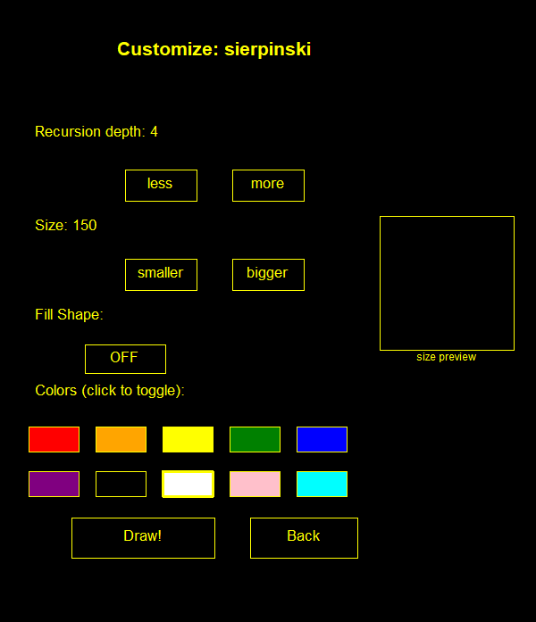

# Fractal Generator

This project is an interactive, menu-driven GUI application built entirely in Python using the Turtle graphics library. It allows users to explore the mathematical beauty of recursion by generating three distinct types of fractals: the Sierpinski Triangle, the Koch Snowflake, and a Fractal Tree. The app features a custom-built button interface that handles real-time customization of recursion depth, size, and multi-color palettes, all while offering a choice between light and dark themes.

## How to use
- **Prepare your files:** Ensure all five project files (main.py, config.py, ui_controls.py, fractals.py, and menus.py) are saved in the same folder.

- **Run the program:** Navigate to fractal_generator\src\main.py and run main.py

- **Navigate the UI:** Use your mouse to click the on-screen buttons. You can select a fractal type, adjust settings, and pick colors.

- **Export your art:** After drawing a fractal, click the "Save Image" button to export your fractal as a .eps file in the project folder.

- *Libraries: There are no external libraries outside of standard python 3.x*

## Details on Project Features
- **Sierpinski Triangle:** The flagship recursive fractal that splits triangles into three smaller versions of themselves. 📐

- **Koch Snowflake:** Generate complex geometric "snow" curves with support for triangle, square, and pentagon base shapes. ❄️

- **Fractal Tree:** An organic branching algorithm that uses recursion to create lifelike tree structures with depth-based branch thickness. 🌳

- **Multi-Color Toggle:** Select multiple colors from a palette to create vibrant, alternating-color recursive levels. 🎨

- **Theme Engine:** Toggle between Light Mode and Dark Mode to change the background and UI aesthetics on the fly. 🌓

- **Fill Toggle:** Specifically for the Sierpinski Triangle, users can toggle between solid filled shapes or clean outlines. 🖌️

- **Instant Export:** Save high-quality vector versions of your fractals with a single click. 💾
