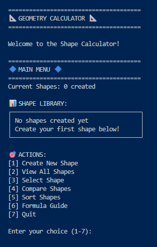

# Geometry Calculator

A terminal-based geometry calculator that allows users to create, manage, and compare different shapes. Users can schedule calculations, view detailed statistics for each shape, and organize their shape library using sorting and comparison tools. The program focuses on clean formatting, interactive menus, and accurate mathematical calculations for common geometric figures.

## How to Use

1. Run the main Python file for the project.
2. Use the numbered menu options to create shapes such as circles, rectangles, squares, and triangles.
3. View all shapes to see detailed information including area and perimeter.
4. Select individual shapes for focused viewing.
5. Compare two shapes to determine which has a larger area or perimeter.
6. Sort shapes by area or perimeter to organize the shape library.

Libraries used:

* `math`
* `os`

## Project Features

* 📐 Create multiple shape types including circles, rectangles, squares, and triangles.
* 📊 Automatically calculates area, perimeter, and other relevant measurements.
* 🧾 Displays formatted detail panels for each shape.
* 🔍 Compare shapes side-by-side based on area and perimeter.
* 📚 Built-in formula guide for quick reference.
* 🔢 Sort shapes from smallest to largest by area or perimeter.
* 🧠 Triangle validation using geometric rules.
* 🎮 Interactive menu-driven terminal interface.

## Contributors

* dogo1017
