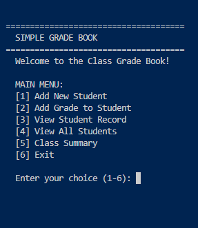

# Simple Grade Book

A terminal-based grade book system that allows teachers to add students, record grades, and view class performance. The program saves all data to a CSV file so nothing is lost between sessions. It features clean menus, input validation, and automatic grade calculations including letter grades and academic standing.

## How to Use

1. Run `main.py` from inside the `src/` folder.
2. Use the numbered menu to add new students with a name, ID, and grade level.
3. Add grades to any student by entering their ID and a score from 0 to 100.
4. View an individual student's full record including their average and academic standing.
5. View all students at once in a formatted table.
6. Check the class summary for the overall average, highest grade, and lowest grade.

Libraries used:

* `csv`
* `os`

## Project Features

* 🎓 Add students with a name, student ID, and grade level (9th through 12th).
* 📝 Record multiple grades per student with input validation (0-100 only).
* 📊 Automatically calculates each student's numerical average and letter grade.
* 🏅 Determines academic standing: Honor Roll, Good Standing, or Needs Improvement.
* 👥 View all students in a formatted table with averages and standings.
* 📈 Class summary showing overall average, highest grade, and lowest grade.
* 💾 All data is saved to a CSV file and reloaded automatically on next run.
* 🖥️ Clean terminal interface that clears between screens.

## Contributors

* dogo1017